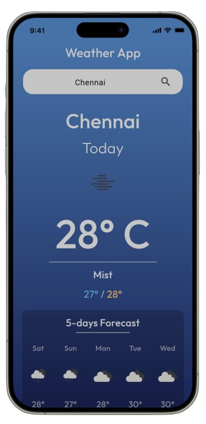

# 🌤️ WeatherApp

 <div display="flex">
    
    <h4>Weather App</h4>
</div>

Welcome to WeatherApp! This Flutter application fetches and displays current weather data and a 5-day weather forecast using the OpenWeatherMap API. It also stores the selected city locally so that the weather data can be displayed even when offline.

## ✨ Features
- 🌐 API Integration

    Used the OpenWeatherMap API to fetch weather data.
    Utilized the free tier which provides current weather and forecast data.
    Key endpoints to use:
    Current weather data: https://api.openweathermap.org/data/2.5/weather
    5-day/3-hour forecast: https://api.openweathermap.org/data/2.5/forecast
    API Key: Ensure you sign up and follow the instructions to get an API key.
- 📦 Local Data Storage
    
    Used the shared_preferences package to store the selected city.
- 🛠️ Functionality

    Allow users to search for a city and fetch weather data.
    Display the current weather data for the selected city.
    Display the 5-day weather forecast in a list view.
    Store the fetched data locally so that it can be displayed even when offline.
    When the app is reopened, it should show the weather data for the last selected city.
- 📸 Screenshots
    <div display="flex">
    
    
    </div>


## 🚀 Getting Started
### Prerequisites
- Flutter SDK

    Ensure you have Flutter installed. Follow the official guide to set up Flutter on your system.
- 🔑 Obtaining API Key

    Go to the OpenWeatherMap API Sign Up page.
    Create an account and log in.
    Navigate to the API keys section.
    Copy the generated API key.
### 📂 Project Setup
- Clone the repository:
```sh
git clone https://github.com/yourusername/weather_app.git 
```
- Navigate to the project directory:
``` sh
cd weather_app
```
- Install dependencies:
``` sh
flutter pub get
```
- Add your API key:

    Create a file named api_key.dart in the `lib/src/api/` directory.
    Add the following code to api_key.dart:
```dart
class APIKeys {
  static const openWeatherAPIKey = 'YOUR_API_KEY';
}
```
- Run the app:
```sh
flutter run
```
## 📚 How to Use
Search for a city: Enter the city name in the search bar and press the search icon.
View current weather: The app will display the current weather data for the selected city.
View 5-day forecast: Scroll down to see the 5-day weather forecast.
Offline mode: The app will use locally stored data to display weather information when offline.
Reopen app: The app will automatically display the weather data for the last selected city when reopened.
🤝 Contributing
Contributions are welcome! Please fork the repository and submit a pull request.

### 📝 License
This project is licensed under the MIT License.

### 📧 Contact
If you have any questions or suggestions, feel free to contact me at vikram.nitpy@gmail.com.
